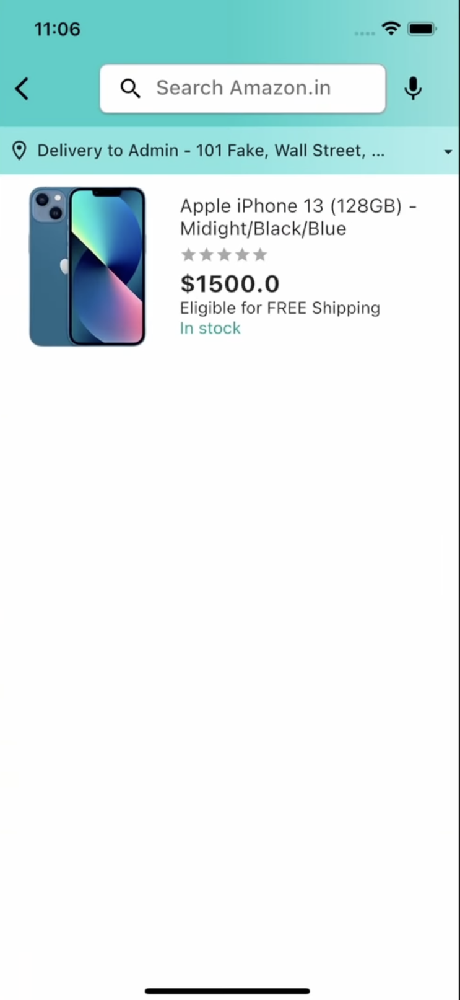
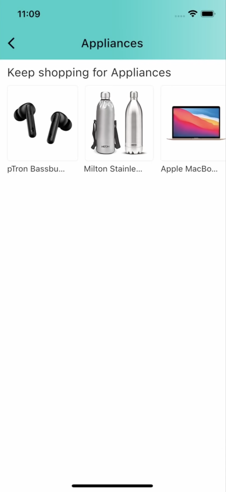
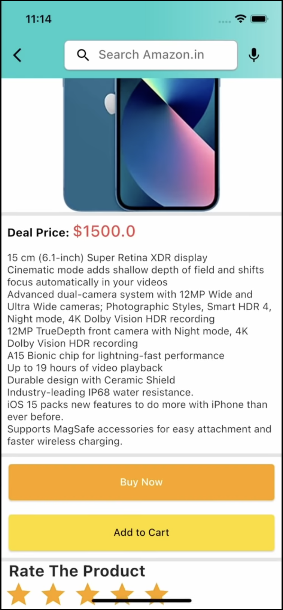

# Amazon Clone E-Commerce App

This is a full-stack e-commerce application built with Flutter for the frontend and Node.js with Express.js for the backend. It utilizes MongoDB as the database for storing product and user information. This project aims to provide a comprehensive learning experience for building a robust and scalable e-commerce solution.

## Features

*   User Authentication:
    *   Secure signup and login with email and password.
    *   JWT-based authentication for secure communication between the client and server.
    *   User state persistence for seamless experience.
*   Product Browsing:
    *   Browse products by category.
    *   View product details, including images, descriptions, and prices.
    *   Search for products.
    *   Filter products by category.
    *   Rate products and view product ratings.
    *   View "Deal of the Day" products.
*   Shopping Cart:
    *   Add products to cart.
    *   Checkout with Google Pay or Apple Pay (not yet implemented).
*   Order Management:
    *   View order history.
*   Admin Panel:
    *   Add, delete, and edit products.
    *   View total earnings and sales graphs by category (not yet implemented).
    *   View and manage orders.

## Technologies Used

*   Frontend:
    *   Flutter
    *   Dart
*   Backend:
    *   Node.js
    *   Express.js
    *   MongoDB

## Data Models

*   **User Model (`user.js`)**
    *   `name`: String (required) - User's full name.
    *   `email`: String (required) - User's email address (must be a valid email format).
    *   `password`: String (required) - User's password (must be at least 8 characters long).
    *   `address`: String (default: '') - User's delivery address.
    *   `type`: String (default: 'user') - User's role ('user' or 'admin').
*   **Product Model (`product.js`)**
    *   `name`: String (required) - Name of the product.
    *   `description`: String (required) - Detailed description of the product.
    *   `images`: Array of Strings (required) - URLs of product images.
    *   `quantity`: Number (required) - Available quantity of the product.
    *   `price`: Number (required) - Price of the product.
    *   `category`: String (required) - Category the product belongs to.

## API Endpoints

*   **Authentication (`auth copy.js`)**
    *   `POST /api/signup`: Create a new user account.
    *   `POST /api/signin`: Sign in with email and password.
*   **Products (`product copy.js`)**
    *   `GET /api/products`: Get a list of products (can filter by category using the `category` query parameter).
*   **Admin (`admin copy.js`)**
    *   `POST /admin/add-product`: Add a new product (requires admin authentication).
    *   `DELETE /admin/delete-product`: Delete a product (requires admin authentication).

## Project Structure

*   Frontend (Flutter):
    *   `main.dart`: Entry point of the application.
    *   `router.dart`: Defines navigation routes.
    *   `bottom_bar.dart`: Handles main navigation between Home, Account, and Cart screens.
    *   `home_screen.dart`: Displays products, deals, and categories.
    *   `account_screen.dart`: Shows user details and order history.
    *   `auth_screen.dart`: Handles user authentication.
*   Backend (Node.js):
    *   `index.js`: Sets up the server and routes.
    *   `auth copy.js`, `user copy.js`: Handles user authentication routes.
    *   `admin copy.js`, `product copy.js`: Handles admin routes for product management.
    *   `auth.js`, `admin.js`: Middleware for authentication and authorization.
    *   `product.js`, `user.js`: Define Mongoose schemas for products and users.

## Installation

1.  Clone the repository: `git clone https://github.com/YatharthDixit/AmazonCloneFlutter`
2.  Install frontend dependencies: `flutter pub get`
3.  Install backend dependencies: `npm install`
4.  Set up MongoDB and update the connection string in `index.js`.

## Running the App

1.  Start the backend server: `node index.js`
2.  Run the Flutter app: `flutter run`

## Contributing

Feel free to contribute to the project by submitting pull requests or reporting issues.

## Screenshots

|||
|:---|:---|
|||

