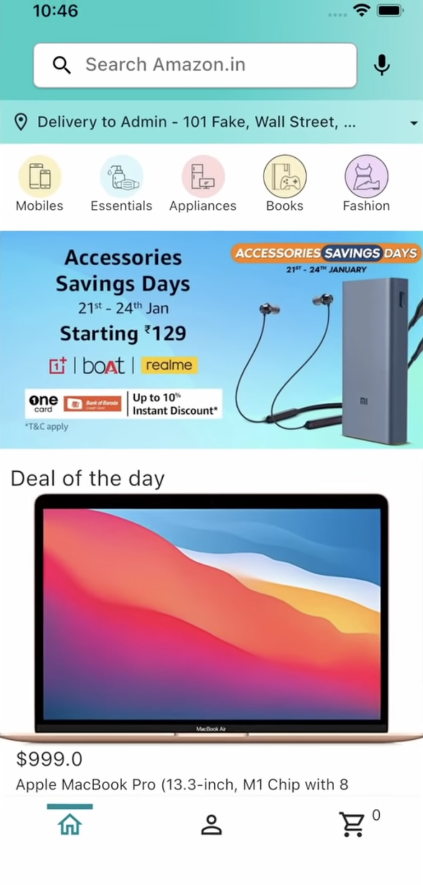

# Amazon Clone E-Commerce App

Welcome to the **Amazon Clone E-Commerce App** project, a comprehensive full-stack application developed using Flutter and Node.js. This tutorial guides you through the step-by-step process of building an e-commerce app with advanced features, enabling you to gain hands-on experience in both frontend and backend development.

## 📚 Project Overview

This project involves creating a fully functional Amazon clone e-commerce application. By following this tutorial, you will learn how to implement key features such as user authentication, product management, and order processing, culminating in a robust and scalable e-commerce solution.

## 🛠️ Technology Stack and Development Insights

The development of this application utilizes a modern and efficient technology stack, ensuring both performance and a seamless user experience. The key technologies and tools used include:

### Frontend

- **Flutter**: The primary framework for building the cross-platform mobile application. Flutter's widget-based architecture facilitates the development of a dynamic and responsive user interface.
- **Dart**: The programming language used with Flutter to build the frontend of the application.

### Backend

- **Node.js**: The runtime environment for executing JavaScript on the server side.
- **Express**: A web application framework for Node.js, used to build the backend API.

### Prerequisites

- Basic understanding of **Flutter** and **Dart**.
- **Node.js** and **Android Studio** installed on your computer.
- No prior knowledge of Node.js, Express, or JavaScript is required.

## 🌟 Key Features and Functionalities

- **🔑 Email and Password Authentication**: Secure user authentication system to manage user access.
- **📊 User State Persistence**: Maintain user state across sessions for a seamless user experience.
- **🔍 Search for Products**: Implement robust search functionality to help users find products quickly.
- **🔖 Filter Products by Category**: Allow users to filter products based on categories for easier browsing.
- **⭐ Rate Products**: Enable users to rate products and view product ratings.
- **🔍 View Product Details**: Provide detailed information about each product.
- **🛒 Add Products to Cart**: Users can add products to their cart for purchase.
- **💳 Checkout with Google or Apple Pay**: Integrate Google Pay and Apple Pay for smooth checkout experiences.
- **📜 View Order History**: Allow users to view their order history.
- **🔧 Admin Panel**: An admin interface to manage products and orders.
  - **Add, Delete, and Edit Products**: Admin functionalities for product management.
  - **View Total Earnings and Sales Graph by Category**: Visualize sales data and earnings by category.
  - **View and Manage Orders**: Admins can manage customer orders efficiently.

## 🌐 Explore and Connect

I invite you to explore the codebase, understand the functionalities, and connect to discuss any ideas or insights. Your feedback is invaluable and will contribute to the ongoing improvement of this project.

## Screenshots

|  |  |
| :--------------------------------: | :--------------------------------: |
|  |  |

---

Embark on this journey to develop a complex e-commerce application. Share the app, empower others, and contribute to the world of full-stack development.
